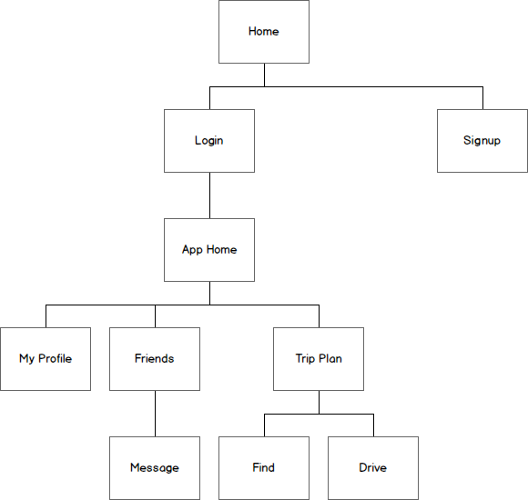
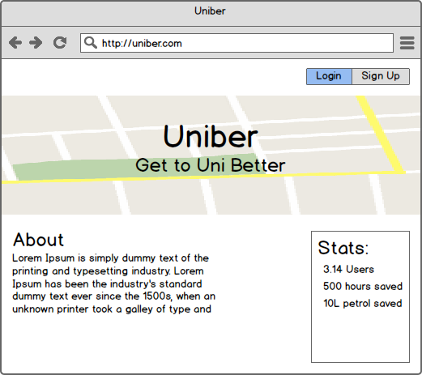
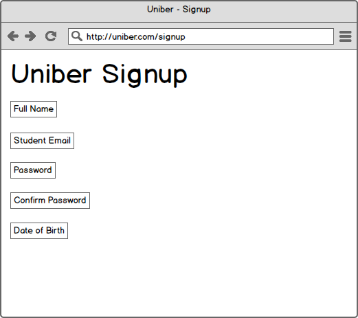
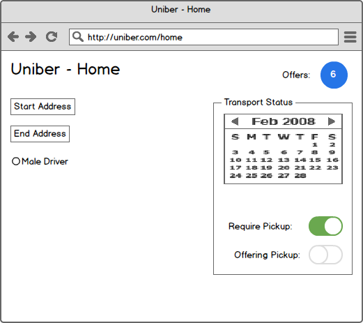
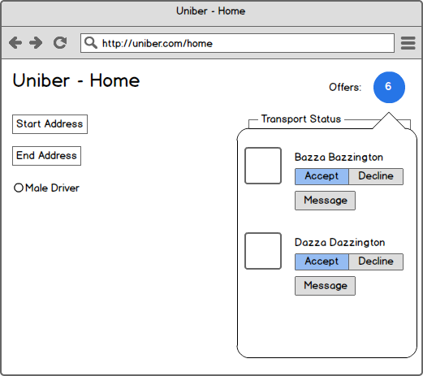
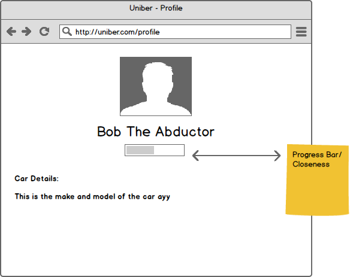
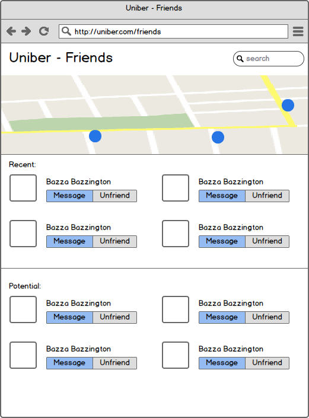

# Prelim Design Document

## Site Structure
The following image outlines the key views in the application.

<br>
<p align="center">

</p>

<hr>
## Website Views / Pages

### Home
This page will be an overview informing people about Uniber and what the app does.
<br>
<p align="center">

</p>
This is the data required and expected format:

```
GET 

{
    "coords" : [
        {"lat":123, "long":456},
        {"lat":123, "long":456},
        {"lat":123, "long":456}
    ],
    "users" : 612,
    "hours_saved" : 500,
    "petrol_saved" : 10
}
```

<hr>


### Signup
The signup page will feature a basic form to establish a user profile.
<br>
<p align="center">

</p>
The following functions need to be implemented:

+ Check that user does not exist
+ Verify `Password` and `Confirm Password` are the same
+ Verify Date of Birth is >= 18
+ Verify email is a valid student email

The following data will be sent to the sever:
 
 
```
POST

{
	"name" : "Dragan Marjanovic",
	"email" : "bobby@uq.edu.au",
	"password" : abc123,
	"dob" : yyyy-mm-dd
}


GET

{
	"status" : 0
}

```

| Status Code  | Meaning       |
| ----- |:-------------:|
| 0     | Success 		 |
| 1     | Email Invalid |
| 2     | Under 18      |

<br>
<hr>

#### App Home

<br>
<p align="center">

</p>

```
POST

{
	"offer_id" : 1234,
	"status" : 0
}
```

Status Code | Description
------------|------------
0| Accepted the offer.
1| Declined the offer.
<hr>


#### Driver Requests
Extension of the "App Home" view. This is the same view with the offers dialog selected to reveal users who are offering a lift. From here the user can select to directly accept the lift, decline, or message if unsure.
<br>
<p align="center">

</p>


Status Code | Description
------------|------------
0           | Accepted the offer.
1| Declined the offer.

<hr>


#### Profile

<br>
<p align="center">

</p><hr>


### Friends and People

<br>
<p align="center">

</p><hr>

<br>
#### Message
Standard messaging interface. There should be an "Accept/Reject" option inside the messaging view.

<p align="center">

</p>